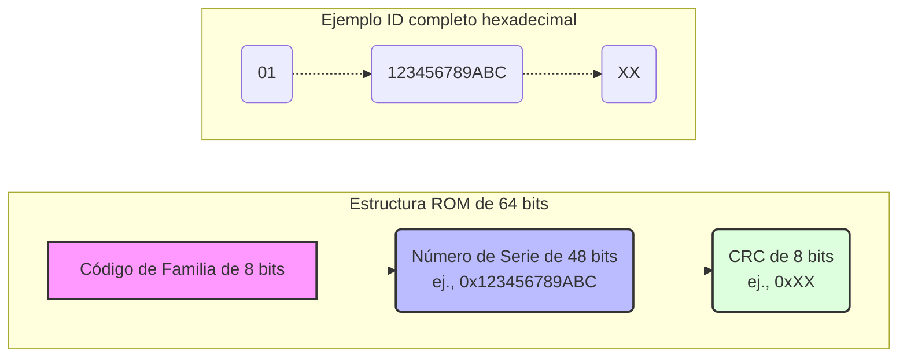
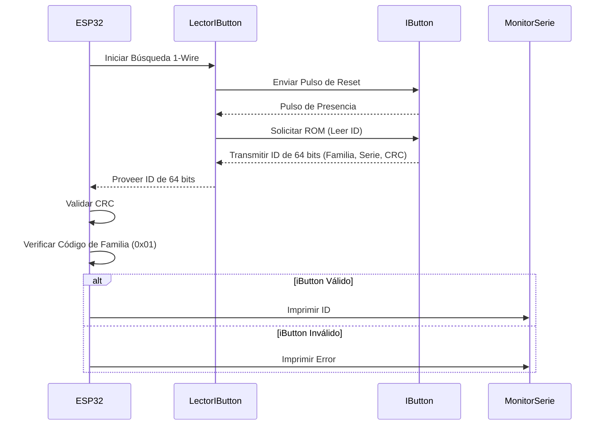
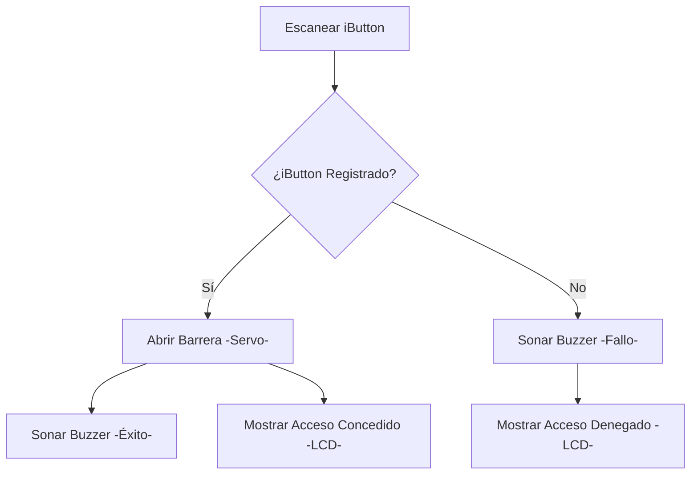
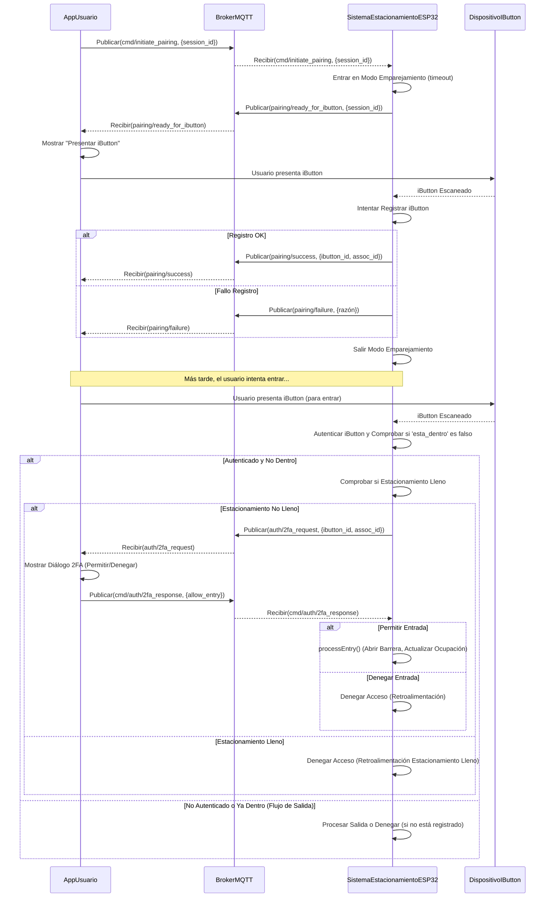

# Sistema de Estacionamiento Inteligente

## Introducción

Este documento detalla el proceso de desarrollo de un sistema de estacionamiento inteligente que utiliza un microcontrolador ESP32, iButton DS1990A para autenticación y comunicación MQTT con una aplicación móvil. El objetivo principal de este proyecto es crear un sistema de control de acceso a estacionamientos seguro y automatizado, con autenticación de doble factor y capacidades de gestión remota. El sistema está diseñado para gestionar la ocupación de las plazas de aparcamiento, proporcionar retroalimentación al usuario a través de una pantalla LCD local y un Buzzer, y permitir acciones administrativas como el registro y la eliminación de iButtons a través de una aplicación móvil complementaria.

## Descripción del proyecto

El núcleo del sistema es un microcontrolador ESP32 que interactúa con varios periféricos: un lector 1-Wire para iButtons DS1990A, un servomotor para controlar una barrera de estacionamiento, una pantalla LCD I2C de 16x2 para mensajes al usuario y un Buzzer para retroalimentación auditiva. La autenticación se basa en el número de serie único de 64 bits de los iButtons DS1990A. El sistema mantiene una base de datos local de iButtons registrados en su EEPROM.

Para una mayor seguridad e interacción remota, el ESP32 se comunica con una aplicación móvil (desarrollada en React Native) utilizando el protocolo MQTT. Esto habilita funciones como el registro remoto de iButtons (emparejamiento), la autenticación de dos factores (2FA) donde se requiere la confirmación de la aplicación para la entrada, y la eliminación remota de iButtons. El sistema también rastrea la ocupación de las plazas de aparcamiento, mostrando un mensaje "Estacionamiento Lleno" cuando no hay plazas disponibles y rechazando los intentos de entrada en consecuencia, incluso antes de iniciar un proceso de 2FA si corresponde.

## Proceso de desarrollo

El desarrollo del sistema de estacionamiento inteligente siguió un enfoque modular e iterativo, construyendo la funcionalidad de forma incremental.

### Configuración inicial del hardware y lectura de iButton

El paso fundamental consistió en interconectar el ESP32 con el lector de iButton DS1990A. Esto requirió la utilización del protocolo de comunicación 1-Wire. Se programó el ESP32 para buscar un dispositivo 1-Wire presente en la línea de datos. Tras la detección, se leyó el código ROM de 64 bits (número de serie) del iButton.

Cada iButton DS1990A contiene un código ROM único de 64 bits, que se estructura de la siguiente manera:

* **Código de Familia de 8 bits:** El primer byte identifica la familia del dispositivo. Para el DS1990A, este es `0x01`.
* **Número de Serie Único de 48 bits:** Los siguientes seis bytes forman el identificador único principal para ese iButton específico.
* **CRC (Verificación de Redundancia Cíclica) de 8 bits:** El último byte es un código CRC calculado a partir de los 56 bits precedentes (el código de familia y el número de serie). Este CRC es utilizado por el dispositivo lector para verificar la integridad de los datos leídos del iButton. Si el CRC calculado no coincide con el CRC almacenado, indica un error de lectura.

Una parte importante de este proceso fue la validación de la integridad de los datos utilizando este CRC de 8 bits. Además, se verificó el código de familia de 8 bits para asegurar que el dispositivo detectado fuera efectivamente un DS1990A (código de familia `0x01`). En las primeras etapas, el ID del iButton validado se imprimía en el monitor serie para su verificación.

### Gestión local de iButton y almacenamiento en EEPROM

Una vez establecida la lectura básica de iButtons, se desarrolló un sistema para gestionar los iButtons registrados. Esto implicó almacenar los datos de los iButtons de forma persistente en la EEPROM del ESP32. Se definió una estructura de datos para almacenar el ID físico de 64 bits de cada iButton registrado, un ID asociado generado por el sistema (para uso potencial con una base de datos backend o una identificación más simple para el usuario), y una bandera que indica si la ranura de la EEPROM estaba actualmente en uso (válida).

Para asegurar la robustez, se implementó un mecanismo de inicialización de la EEPROM. Se comprueba un valor de firma específico al arrancar; si no está presente, el área de la EEPROM designada para el almacenamiento de iButtons se formatea (las ranuras se marcan como inválidas). Esto evita problemas con datos de EEPROM no inicializados (a menudo todos `0xFF`) que se malinterpretan como entradas válidas. Se reservó un pequeño desplazamiento al principio de la EEPROM para dicha firma y futuras variables de configuración.

Se crearon funciones de gestión básicas: registrar un nuevo iButton (que asigna automáticamente el siguiente ID asociado disponible y encuentra una ranura libre), verificar si un iButton ya está registrado (y recuperar sus datos asociados), y eliminar el registro de un iButton (marcando lógicamente su ranura como inválida). Estas funciones se modularizaron en archivos de cabecera y fuente separados para una mejor organización del código.

### Control de acceso básico con Servo y retroalimentación al usuario

Con las capacidades de registro de iButton implementadas, se implementó el control de acceso básico. Se interconectó un servomotor, que representa la barrera de estacionamiento, con el ESP32. Tras un escaneo exitoso de iButton, si el iButton se encontraba en el registro local de la EEPROM, el sistema ordenaría al servo moverse a una posición "abierta" durante una duración predefinida, y luego regresar a una posición "cerrada".

Para proporcionar retroalimentación inmediata al usuario, se integraron un Buzzer y una pantalla LCD I2C de 16x2. El Buzzer proporciona señales auditivas: un pitido corto para acceso exitoso (apertura de la barrera) y pitidos intermitentes si se presenta un iButton no registrado o se deniega el acceso por otras razones. El gestor de la LCD, también modularizado, se encarga de mostrar mensajes. Muestra un mensaje de bienvenida al arrancar, la ocupación actual del estacionamiento por defecto, y mensajes temporales para eventos específicos como "Acceso Concedido", "Acceso Denegado", "Estacionamiento Lleno", "iButton Registrado", etc. Estos mensajes temporales revierten a la visualización de ocupación por defecto después de una duración establecida.

### Control de ocupación del estacionamiento

Para gestionar la disponibilidad de plazas de aparcamiento, se desarrolló un sistema de control de ocupación. Se estableció una constante que define el número total de plazas de aparcamiento. Se mantuvo un contador para el número actual de plazas ocupadas (`ocupacion_actual`) en RAM y también se persistió en una sección reservada de la EEPROM para sobrevivir a los reinicios. El registro del iButton en la EEPROM se aumentó con una bandera booleana `esta_dentro`.

Cuando se presenta un iButton autenticado para entrar:

1. El sistema primero comprueba si `ocupacion_actual < TOTAL_PLAZAS_APARCAMIENTO`.
2. Si hay espacio disponible, se llama a la función `procesarEntrada`. Esta función incrementa `ocupacion_actual`, establece la bandera `esta_dentro` del iButton a verdadero en la EEPROM, abre la barrera y proporciona retroalimentación de éxito.
3. Si el estacionamiento está lleno, se deniega la entrada inmediatamente y se da la retroalimentación apropiada a través de LCD y Buzzer. Esta comprobación ocurre *antes* de iniciar cualquier proceso de 2FA.

Cuando se presenta un iButton autenticado (cuya bandera `esta_dentro` es verdadera) (asumido que está en el mismo punto de entrada/salida), se llama a la función `procesarSalida`. Esto decrementa `ocupacion_actual`, establece `esta_dentro` a falso, abre la barrera y proporciona retroalimentación. También se añadió un mecanismo de enfriamiento para evitar que un solo escaneo de iButton active múltiples operaciones de entrada/salida rápidamente.

### Integración MQTT para comunicación remota

MQTT (Message Queuing Telemetry Transport) es un protocolo de red ligero de publicación-suscripción ideal para conectar dispositivos IoT. En este proyecto, tanto el ESP32 como la aplicación móvil actúan como clientes MQTT, conectándose a un broker MQTT central, por ejemplo, `broker.emqx.io`. La comunicación se organiza utilizando una estructura de tópicos jerárquica, con un prefijo para evitar conflictos en brokers públicos, por ejemplo, `juanliz-sparking-esp32/`. El ESP32 publica actualizaciones de estado (como ocupación, estado en línea) y mensajes impulsados por eventos (como solicitudes de 2FA, resultados de escaneo de iButton). La aplicación móvil publica comandos (como iniciar emparejamiento, responder a 2FA, iniciar modo de eliminación) a los que el ESP32 está suscrito.

Para habilitar la gestión remota y la autenticación de doble factor utilizando este protocolo, se integró la comunicación MQTT en el ESP32. El ESP32 se conecta al broker MQTT público configurado a través de WiFi. Se definió un prefijo de tópico base único, por ejemplo `juanliz-sparking-esp32/`, para todas las comunicaciones hacia y desde este sistema de estacionamiento específico.

El ESP32 publica su estado, incluyendo su estado en línea y la ocupación actual del estacionamiento, a un sub-tópico `status`, por ejemplo `juanliz-sparking-esp32/status`. Este mensaje de estado se publica con la bandera `retain` establecida en verdadero, para que los nuevos clientes que se suscriban a este tópico reciban inmediatamente el último estado conocido. Las actualizaciones de ocupación también se publican a medida que ocurren. El ESP32 también se suscribe a varios sub-tópicos de comando para recibir instrucciones de la aplicación móvil complementaria.

### Gestión remota de iButton y 2FA a través de la aplicación móvil

Se conceptualizó y desarrolló una aplicación móvil React Native para interactuar con el ESP32 a través de MQTT. La aplicación también se conecta al mismo broker MQTT y utiliza la misma estructura de tópico base.

**Registro de emparejamiento remoto de iButton:**
La aplicación puede iniciar un proceso de emparejamiento.

1. La aplicación envía un comando a `[PREFIJO]/cmd/initiate_pairing` con un ID de sesión de emparejamiento único.
2. El ESP32 recibe esto, entra en un modo de "esperando iButton para emparejamiento", establece un tiempo de espera y, opcionalmente, confirma la preparación mediante `[PREFIJO]/pairing/ready_for_ibutton`.
3. El usuario presenta un nuevo iButton al lector del ESP32.
4. El ESP32 intenta registrarlo. Luego publica en `[PREFIJO]/pairing/success` (con ID de iButton e ID asociado) o `[PREFIJO]/pairing/failure` (con una razón).
5. La aplicación recibe el resultado e informa al usuario.

**Autenticación de Dos Factores (2FA) para la entrada:**
Cuando se escanea un iButton registrado para la entrada, y si se configura 2FA como requerido (asumido verdadero para esta fase de desarrollo):

1. El ESP32 primero comprueba si el estacionamiento está lleno. Si está lleno, el acceso se deniega inmediatamente y no se envía ninguna solicitud de 2FA.
2. Si hay espacio disponible, el ESP32 publica un mensaje en `[PREFIJO]/auth/2fa_request` que contiene el ID del iButton y su ID asociado. La barrera permanece cerrada.
3. La aplicación móvil, suscrita a este tópico, recibe la solicitud. Presenta una notificación local (si está en segundo plano) o un diálogo en la aplicación (si está en primer plano) al usuario, solicitando confirmación.
4. El usuario responde a través de la aplicación (Permitir/Denegar), a menudo después de una verificación biométrica en el teléfono.
5. La aplicación publica la decisión en `[PREFIJO]/cmd/auth/2fa_response` (con `allow_entry: true/false`).
6. El ESP32 recibe esta respuesta. Si `allow_entry` es verdadero, procede con la lógica `processEntry` (abrir barrera, actualizar ocupación). Si es falso o si ocurre un tiempo de espera en el ESP32 esperando la respuesta de la aplicación, se deniega la entrada.

**Eliminación Remota de iButton:**
Se implementó un flujo similar para eliminar iButtons remotamente.

1. La aplicación envía un comando a `[PREFIJO]/cmd/ibutton/initiate_delete_mode`.
2. El ESP32 entra en "modo eliminación" con un tiempo de espera.
3. El usuario presenta el iButton a eliminar.
4. El ESP32 intenta la eliminación y publica el resultado (`delete_success` o `delete_failure`).
5. La aplicación también puede enviar un comando `[PREFIJO]/cmd/ibutton/cancel_delete_mode` para instruir al ESP32 a salir del modo de eliminación antes de un tiempo de espera o la presentación del iButton.

## Conclusiones

El sistema de estacionamiento inteligente desarrollado integra con éxito la tecnología iButton para una robusta autenticación local con un microcontrolador ESP32. La adición de la comunicación MQTT expande significativamente sus capacidades, permitiendo funciones de gestión remota y un proceso seguro de autenticación de dos factores a través de una aplicación móvil complementaria. Las funcionalidades clave logradas incluyen el registro y eliminación fiables de iButtons (tanto localmente mediante comandos serie como remotamente vía MQTT), el seguimiento preciso y almacenamiento persistente de la ocupación del estacionamiento, y una clara retroalimentación al usuario a través de una pantalla LCD y un Buzzer.

El diseño modular del firmware del ESP32 (separando la gestión de iButton, el control de LCD y la comunicación MQTT en módulos distintos) resultó beneficioso para el desarrollo, las pruebas y la mantenibilidad. La implementación iterativa, comenzando desde la lectura básica de iButton y añadiendo progresivamente características como almacenamiento en EEPROM, control de servo, retroalimentación al usuario, conteo de ocupación y finalmente integración MQTT, permitió un proceso de desarrollo estructurado.

Las mejoras futuras podrían incluir la implementación de algunas características como:

* Autenticaciones selectivas, permitiendo solo el emparejamiento desde un dispositivo y mostrando notificaciones para autenticaciones basadas en iButtons registrados en el dispositivo.
* Eliminación remota protegida por contraseña.
* Aplicación configurable de 2FA.
* Un servidor backend más sofisticado en lugar de MQTT directo de aplicación a ESP32 para algunas operaciones.
* Y potencialmente usar un sensor dedicado para una detección de salida más fiable para mejorar la precisión de la ocupación.
* El uso de una biblioteca de análisis JSON como ArduinoJson en el ESP32.
* Una estrategia de manejo de mensajes MQTT más avanzada (como múltiples oyentes o un bus de eventos completo) en la aplicación React Native.

Pero, en general, para el alcance de este proyecto, la implementación actual es robusta y cumple eficazmente los requisitos iniciales.

En general, el proyecto demuestra una solución viable y rica en funciones para un sistema de estacionamiento inteligente, equilibrando la interacción de hardware local con la conectividad IoT moderna.

# Referencias

* Callstack. (2025). Getting started. *React Native Paper*. [https://callstack.github.io/react-native-paper/docs/guides/getting-started/](https://callstack.github.io/react-native-paper/docs/guides/getting-started/)
* Dallas Semiconductor. (1999). *DS1990A Serial Number iButton™* [Datasheet]. [https://www.alldatasheet.es/datasheet-pdf/download/58567/DALLAS/DS1990.html](https://www.alldatasheet.es/datasheet-pdf/download/58567/DALLAS/DS1990.html)
* EMQX. (2023). Introduction to MQTT publish-subscribe pattern. *EMQX Blog*. [https://www.emqx.com/en/blog/mqtt-5-introduction-to-publish-subscribe-model](https://www.emqx.com/en/blog/mqtt-5-introduction-to-publish-subscribe-model)
* EMQX. (2024). Connect to deployment using React Native via MQTT.js SDK. *EMQX Platform Docs*. [https://docs.emqx.com/en/cloud/latest/connect_to_deployments/react_native_expo_sdk.html](https://docs.emqx.com/en/cloud/latest/connect_to_deployments/react_native_expo_sdk.html)
* Expo. (2025). LocalAuthentication. *Expo Documentation*. [https://docs.expo.dev/versions/latest/sdk/local-authentication/](https://docs.expo.dev/versions/latest/sdk/local-authentication/)
* Expo. (2025). Notifications. *Expo Documentation*. [https://docs.expo.dev/versions/latest/sdk/notifications/](https://docs.expo.dev/versions/latest/sdk/notifications/)
* O’Leary, N. (2020). *knolleary/pubsubclient: A client library for the Arduino Ethernet Shield that provides support for MQTT.* GitHub. [https://github.com/knolleary/pubsubclient](https://github.com/knolleary/pubsubclient)
* Stoffregen, P. (2024). *PaulStoffregen/OneWire: Library for Dallas/Maxim 1-Wire Chips*. GitHub. [https://github.com/PaulStoffregen/OneWire](https://github.com/PaulStoffregen/OneWire)

# Apéndices

Repositorio de código del proyecto (GitHub): [https://github.com/JuanLiz/smart-parking-esp32](https://github.com/JuanLiz/smart-parking-esp32)

Repositorio de código de la aplicación móvil (GitHub): [https://github.com/JuanLiz/smart-parking-mqtt](https://github.com/JuanLiz/smart-parking-mqtt)
