

# Smart Parking System

## Introduction

This document details the development process of a smart parking system utilizing an ESP32 microcontroller, DS1990A iButton for authentication, and MQTT communication with a mobile application. The primary goal of this project is to create a secure and automated parking access control system, featuring dual-factor authentication and remote management capabilities. The system is designed to manage parking space occupancy, provide user feedback through a local LCD display and buzzer, and allow for administrative actions such as iButton registration and deletion via a companion mobile application.

## Project description

The core of the system is an ESP32 microcontroller that interfaces with several peripherals: a 1-Wire reader for DS1990A iButtons, a servomotor to control a parking barrier, a 16x2 I2C LCD display for user messages, and a buzzer for auditory feedback. Authentication is based on the unique 64-bit serial number of DS1990A iButtons. The system maintains a local database of registered iButtons in its EEPROM.

For enhanced security and remote interaction, the ESP32 communicates with a mobile application (developed in React Native) using the MQTT protocol. This enables features such as remote iButton registration (pairing), two-factor authentication (2FA) where app confirmation is required for entry, and remote iButton deletion. The system also tracks parking space occupancy, displaying a "Parking Full" message when no spots are available and rejecting entry attempts accordingly, even before initiating a 2FA process if applicable.

## Development Process

The development of the smart parking system followed a modular and iterative approach, building functionality incrementally.

### Initial hardware setup and iButton reading

The foundational step involved interfacing the ESP32 with the DS1990A iButton reader. This required utilizing the 1-Wire communication protocol. The ESP32 was programmed to search for a 1-Wire device present on the data line. Upon detection, the 64-bit ROM code (serial number) of the iButton was read.

Each DS1990A iButton contains a unique 64-bit ROM code, which is structured as follows:

* **8-bit Family Code:** The first byte identifies the device family. For the DS1990A, this is `0x01`.
* **48-bit Unique Serial Number:** The next six bytes form the core unique identifier for that specific iButton.
* **8-bit CRC (Cyclic Redundancy Check):** The final byte is a CRC code calculated from the preceding 56 bits (the family code and the serial number). This CRC is used by the reading device to verify the integrity of the data read from the iButton. If the calculated CRC does not match the stored CRC, it indicates a read error.

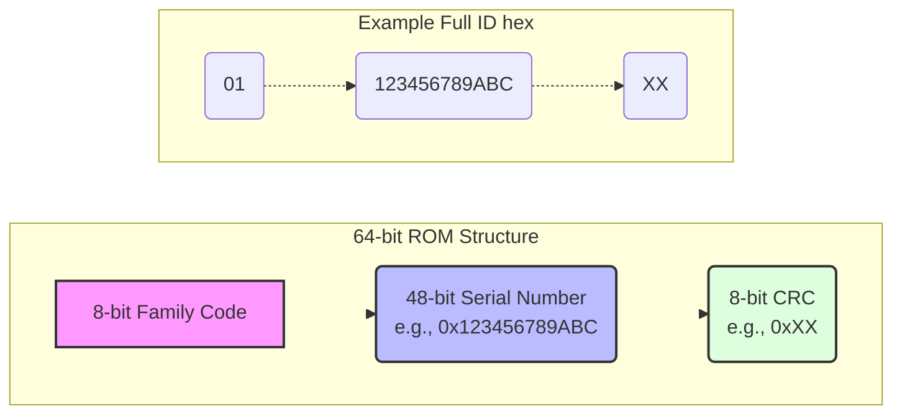

An important part of this process was the validation of the data integrity using this 8-bit CRC. Additionally, the 8-bit family code was checked to ensure the detected device was indeed a DS1990A (family code `0x01`). In the early stages, the validated iButton ID was printed to the serial monitor for verification.

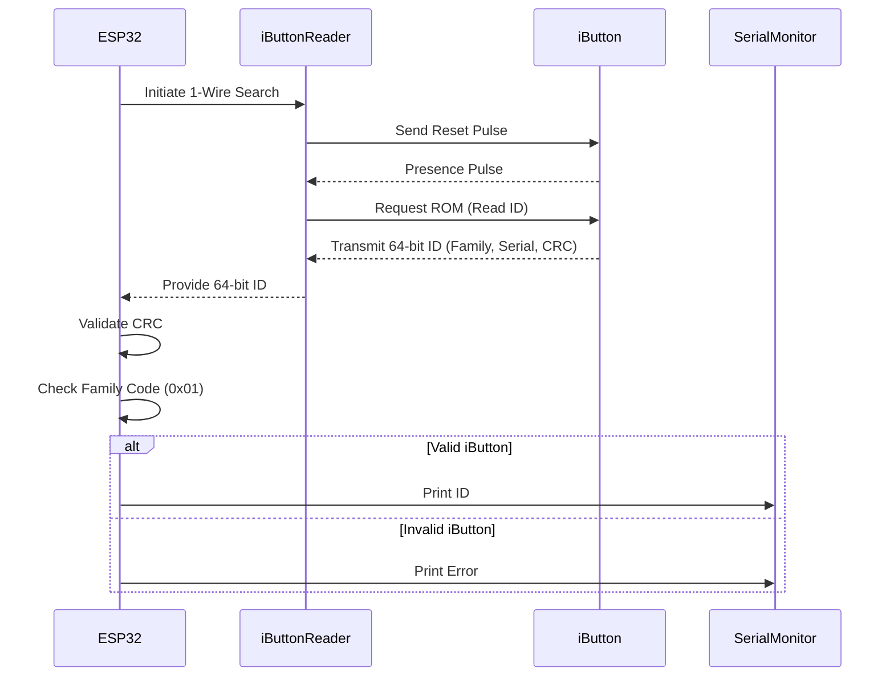

### Local iButton management and EEPROM storage

Once basic iButton reading was established, a system for managing registered iButtons was developed. This involved storing iButton data persistently in the ESP32's EEPROM. A data structure was defined to hold each registered iButton's 64-bit physical ID, a system-generated associated ID (for potential use with a backend database or simpler user-facing identification), and a flag indicating if the EEPROM slot was currently in use (valid).

To ensure robustness, an EEPROM initialization mechanism was implemented. A specific signature value is checked at startup; if not present, the EEPROM area designated for iButton storage is formatted (slots marked as invalid). This prevents issues with uninitialized EEPROM data (often all `0xFF`) being misinterpreted as valid entries. A small offset at the beginning of the EEPROM was reserved for such a signature and future configuration variables.

Core management functions were created: registering a new iButton (which automatically assigns the next available associated ID and finds a free slot), checking if an iButton is already registered (and retrieving its associated data), and deleting an iButton's registration (logically marking its slot as invalid). These functions were modularized into separate header and source files for better code organization.

### Basic access control with Servo and user feedback

With iButton registration capacidades in place, basic access control was implemented. A servomotor, representing the parking barrier, was interfaced with the ESP32. Upon a successful iButton scan, if the iButton was found in the local EEPROM registry, the system would command the servo to move to an "open" position for a predefined duration, then return to a "closed" position.

To provide immediate user feedback, a buzzer and a 16x2 I2C LCD screen were integrated. The buzzer provides auditory cues: a short beep for successful access (gate opening) and intermittent beeps if an unregistered iButton is presented or access is denied for other reasons. The LCD manager, also modularized, handles displaying messages. It shows a welcome message on startup, the current parking occupancy by default, and temporary messages for specific events like "Access Granted," "Access Denied," "Parking Full," "iButton Registered," etc. These temporary messages revert to the default occupancy display after a set duration.

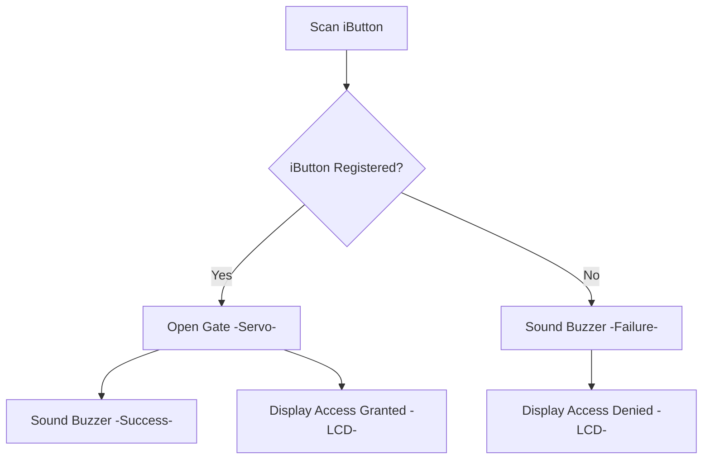

### Parking occupancy control

To manage the availability of parking spaces, an occupancy control system was developed. A constant defining the total number of parking spaces was set. A counter for the current number of occupied spaces (`current_occupancy`) was maintained in RAM and also persisted in a reserved section of the EEPROM to survive reboots. The iButton registration record in EEPROM was augmented with an `is_inside` boolean flag.

When an authenticated iButton is presented for entry:

1. The system first checks if `current_occupancy < TOTAL_PARKING_SPACES`.
2. If space is available, the `processEntry` function is called. This function increments `current_occupancy`, sets the iButton's `is_inside` flag to true in EEPROM, opens the gate, and provides success feedback.
3. If the parking is full, entry is denied immediately, and appropriate feedback is given via LCD and buzzer. This check occurs *before* initiating any 2FA process.

When an authenticated iButton (whose `is_inside` flag is true) is presented (assumed to be at the same entry/exit point), the `processExit` function is called. This decrements `current_occupancy`, sets `is_inside` to false, opens the gate, and provides feedback. A cooldown mechanism was also added to prevent a single iButton scan from triggering multiple entry/exit operations quickly.

### MQTT integration for remote communication

MQTT (Message Queuing Telemetry Transport) is a lightweight, publish-subscribe network protocol ideal for connecting IoT devices. In this project, both the ESP32 and the mobile application act as MQTT clients, connecting to a central MQTT broker, for example, `broker.emqx.io`. Communication is organized using a hierarchical topic structure, prefixed to avoid conflicts on public brokers, for example, `juanliz-sparking-esp32/`. The ESP32 publishes status updates (like occupancy, online status) and event-driven messages (like 2FA requests, iButton scan results). The mobile application publishes commands (like initiating pairing, responding to 2FA, initiating delete mode) to which the ESP32 is subscribed.

To enable remote management and dual-factor authentication using this protocol, MQTT communication was integrated into the ESP32. The ESP32 connects to the configured public MQTT broker over WiFi. A unique base topic prefix, for example `juanliz-sparking-esp32/`, was defined for all communications to and from this specific parking system.

The ESP32 publishes its status, including its online state and the current parking occupancy, to a `status` sub-topic, for example `juanliz-sparking-esp32/status`. This status message is published with the `retain` flag set to true, so new clients subscribing to this topic immediately receive the last known status. Updates to occupancy are also published as they occur. The ESP32 also subscribes to various command sub-topics to receive instructions from the companion mobile application.

### Remote iButton management and 2FA via mobile app

A React Native mobile application was conceptualized and developed to interact with the ESP32 via MQTT. The application also connects to the same MQTT broker and uses the same base topic structure.

**Remote iButton pairing registration:**
The app can initiate a pairing process.

1. App sends a command to `[PREFIX]/cmd/initiate_pairing` with a unique pairing session ID.
2. ESP32 receives this, enters a "waiting for iButton for pairing" mode, sets a timeout, and optionally confirms readiness via `[PREFIX]/pairing/ready_for_ibutton`.
3. User presents a new iButton to the ESP32's reader.
4. ESP32 attempts to register it. It then publishes to `[PREFIX]/pairing/success` (with iButton ID and associated ID) or `[PREFIX]/pairing/failure` (with a reason).
5. The app receives the result and informs the user.

| 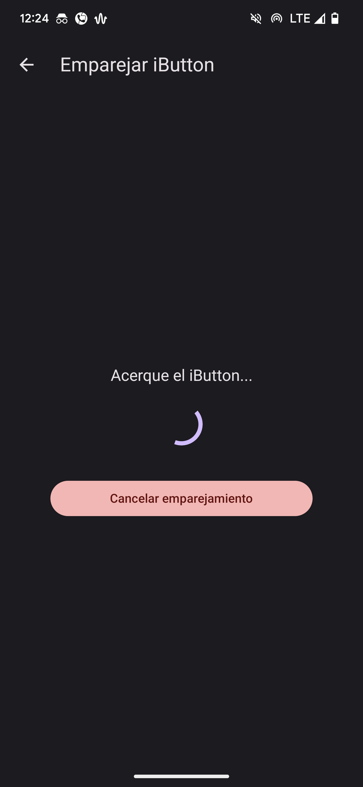 | 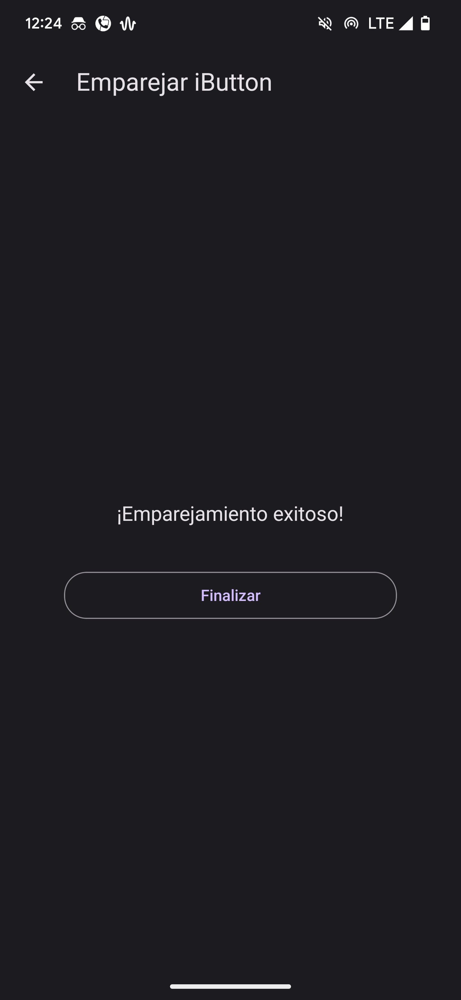 |
|:---:|:---:|
| *iButton pairing process* | *iButton pairing success* |

**Two-Factor Authentication (2FA) for entry:**
When a registered iButton is scanned for entry, and if 2FA is configured as required (assumed true for this development phase):

1. ESP32 first checks if the parking is full. If full, access is denied immediately, and no 2FA request is sent.
2. If space is available, the ESP32 publishes a message to `[PREFIX]/auth/2fa_request` containing the iButton's ID and its associated ID. The barrier remains closed.
3. The mobile app, subscribed to this topic, receives the request. It presents a local notification (if in the background) or an in-app dialog (if in the foreground) to the user, asking for confirmation.
4. User responds via the app (Permit/Deny), often after a biometric check on the phone.
5. App publishes the decision to `[PREFIX]/cmd/auth/2fa_response` (with `allow_entry: true/false`).
6. ESP32 receives this response. If `allow_entry` is true, it proceeds with the `processEntry` logic (opening gate, updating occupancy). If false or if a timeout occurs on the ESP32 waiting for the app's response, entry is denied.

| 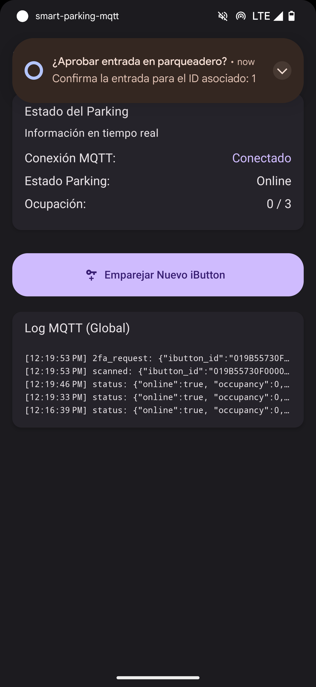 | 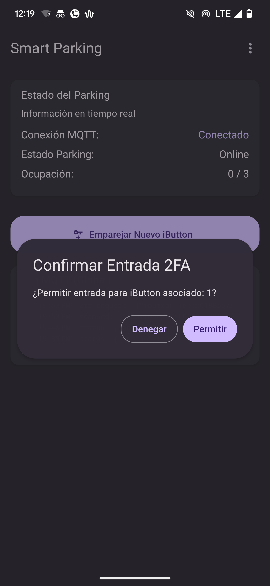 |
|:---:|:---:|
| *Authentication notification when app is in background* | *Authentication notification detail* |

| 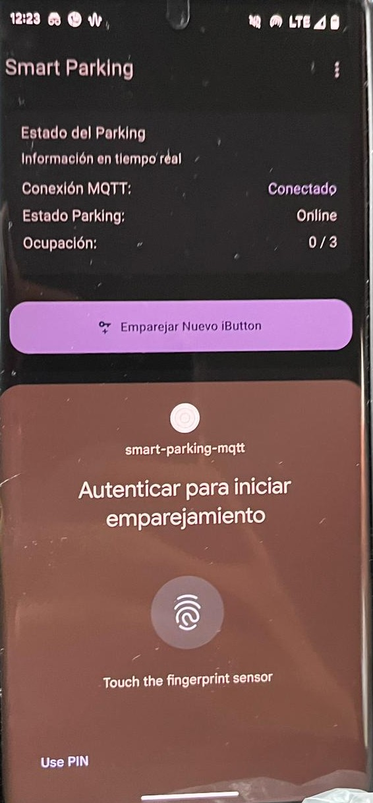 | 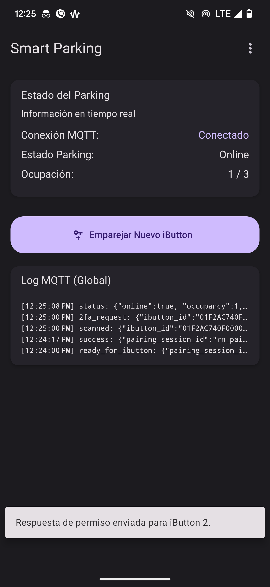 |
|:---:|:---:|
| *Authentication flow in the app* | *Entry approval process* |

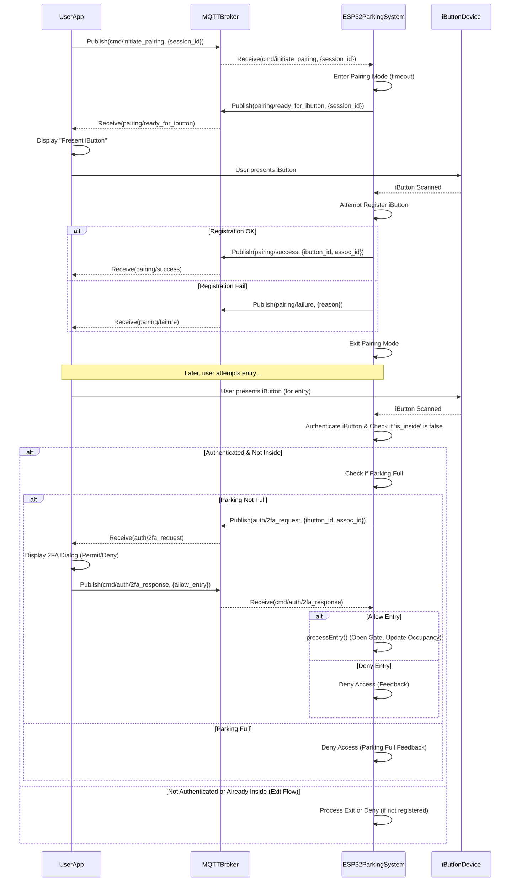

**Remote iButton Deletion:**
A similar flow was implemented for deleting iButtons remotely.

1. App sends a command to `[PREFIX]/cmd/ibutton/initiate_delete_mode`.
2. ESP32 enters "delete mode" with a timeout.
3. User presents the iButton to be deleted.
4. ESP32 attempts deletion and publishes the result (`delete_success` or `delete_failure`).
5. The app can also send a `[PREFIX]/cmd/ibutton/cancel_delete_mode` command to instruct the ESP32 to exit delete mode before a timeout or iButton presentation.

| 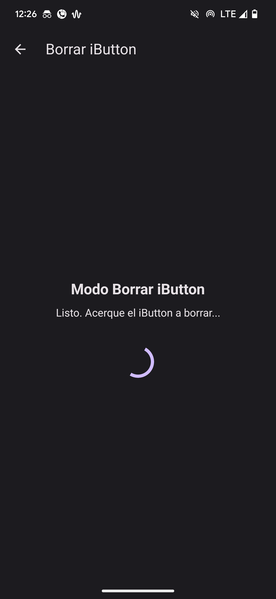 | 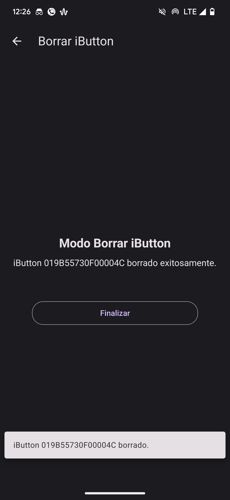 |
|:---:|:---:|
| *Initiating iButton deletion mode* | *iButton deletion success* |

## Conclusions

The developed smart parking system successfully integrates iButton technology for robust local authentication with an ESP32 microcontroller. The addition of MQTT communication significantly expands its capabilities, enabling remote management features and a secure two-factor authentication process through a companion mobile application. Key functionalities achieved include reliable iButton registration and deletion (both locally via serial commands and remotely via MQTT), accurate tracking and persistent storage of parking occupancy, and clear user feedback through an LCD display and buzzer.

The modular design of the ESP32 firmware (separating iButton management, LCD control, and MQTT communication into distinct modules) proved beneficial for development, testing, and maintainability. The iterative implementation, starting from basic iButton reading and progressively adding features like EEPROM storage, servo control, user feedback, occupancy counting, and finally MQTT integration, allowed for a structured development process.

Future enhancements could be implementing some features like:

* Selective authentications, only allowing pairing from a dvice and showing notificationsdor authentications based on registered iButtons in the device
* password-protected remote deletion
* configurable 2FA enforcement
* a more sophisticated backend server instead of direct app-to-ESP32 MQTT for some operations
* and potentially using a dedicated sensor for more reliable exit detection to improve occupancy accuracy.
* The use of a JSON parsing library like ArduinoJson on the ESP32
* a more advanced MQTT message handling strategy (like multiple listeners or a full event bus) in the React Native app.

But, in general, for the scope of this project, the current implementation is robust and meets the initial requirements effectively.

Overall, the project demonstrates a viable and feature-rich solution for a smart parking system, balancing local hardware interaction with modern IoT connectivity.

# References

* Callstack. (2025). Getting started. *React Native Paper*. [https://callstack.github.io/react-native-paper/docs/guides/getting-started/](https://callstack.github.io/react-native-paper/docs/guides/getting-started/)
* Dallas Semiconductor. (1999). *DS1990A Serial Number iButton™* [Datasheet]. [https://www.alldatasheet.es/datasheet-pdf/download/58567/DALLAS/DS1990.html](https://www.alldatasheet.es/datasheet-pdf/download/58567/DALLAS/DS1990.html)
* EMQX. (2023). Introduction to MQTT publish-subscribe pattern. *EMQX Blog*. [https://www.emqx.com/en/blog/mqtt-5-introduction-to-publish-subscribe-model](https://www.emqx.com/en/blog/mqtt-5-introduction-to-publish-subscribe-model)
* EMQX. (2024). Connect to deployment using React Native via MQTT.js SDK. *EMQX Platform Docs*. [https://docs.emqx.com/en/cloud/latest/connect_to_deployments/react_native_expo_sdk.html](https://docs.emqx.com/en/cloud/latest/connect_to_deployments/react_native_expo_sdk.html)
* Expo. (2025). LocalAuthentication. *Expo Documentation*. [https://docs.expo.dev/versions/latest/sdk/local-authentication/](https://docs.expo.dev/versions/latest/sdk/local-authentication/)
* Expo. (2025). Notifications. *Expo Documentation*. [https://docs.expo.dev/versions/latest/sdk/notifications/](https://docs.expo.dev/versions/latest/sdk/notifications/)
* O’Leary, N. (2020). *knolleary/pubsubclient: A client library for the Arduino Ethernet Shield that provides support for MQTT.* GitHub. https://github.com/knolleary/pubsubclient
* Stoffregen, P. (2024). *PaulStoffregen/OneWire: Library for Dallas/Maxim 1-Wire Chips*. GitHub. [https://github.com/PaulStoffregen/OneWire](https://github.com/PaulStoffregen/OneWire)

# Appendices

Project code repository (GitHub): [https://github.com/JuanLiz/smart-parking-esp32](https://github.com/JuanLiz/smart-parking-esp32)

Mobile application code repository (GitHub): [https://github.com/JuanLiz/smart-parking-mqtt](https://github.com/JuanLiz/smart-parking-mqtt)
